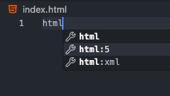
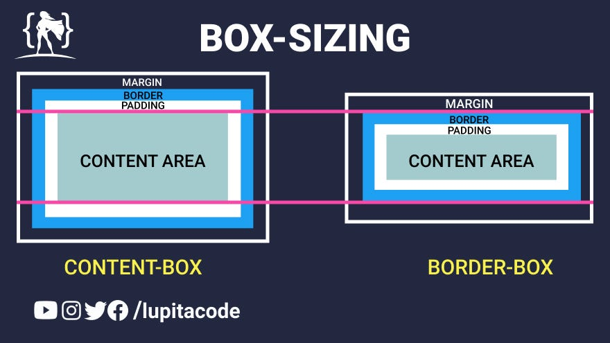
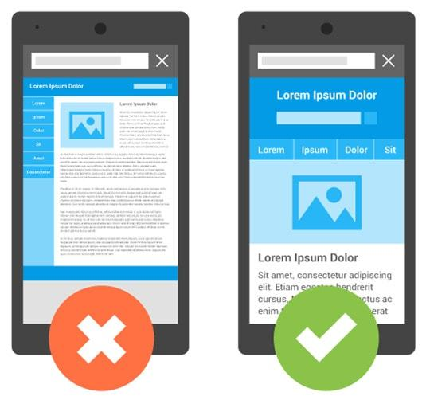

# Poc CSS Basic

### Live-Server

Utilize a extensão Live-Server do Visual Studio Code para rodar o projeto.

Clique com o botão direito no arquivo _index.html_ e selecione a opção _"Open with Live Server"_ ou _"Abrir com o Live Server"_.

## Dicas

1. Gerar um layout padrão HTML5 com o Visual Studio Code:

```html
! + tab
```

ou digite

```html
html:5 + tab
```



2. O padrão de reset CSS serve para remover as margens e paddings padrões dos elementos HTML.

```css
/* CSS Reset */
* {
  margin: 0;
  padding: 0;
  box-sizing: border-box;
}

body {
  font-family: Arial, sans-serif;
}

a {
  text-decoration: none;
}

ul {
  list-style: none;
}
```

3. Entenda o conceito de _box-sizing_. O valor _border-box_ faz com que a largura e a altura de um elemento incluam o preenchimento e a borda, mas não a margem.
   

4. Entenda o conceito de _viewport_. O viewport é a área visível de uma página da web. Ele varia de acordo com o dispositivo e pode ser menor que a resolução da tela.
   

5. Entenda sobre _em_ e _rem_. O _em_ é uma unidade de medida relativa ao tamanho da fonte do elemento pai. O _rem_ é uma unidade de medida relativa ao tamanho da fonte do elemento raiz (root element).

6. Entenda _flexbox_. O flexbox é um modelo de layout unidimensional que permite distribuir itens em um contêiner, mesmo quando o tamanho dos itens é desconhecido ou dinâmico. [Acesse este guia](https://css-tricks.com/snippets/css/a-guide-to-flexbox/)

7. Entenda sobre seletores CSS. [Acesse este guia](https://www.w3schools.com/cssref/css_selectors.asp)
